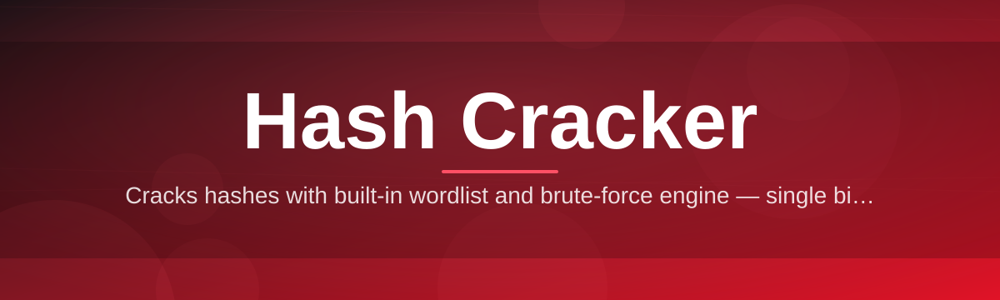
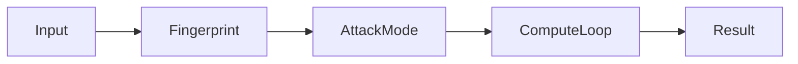

# hash-cracker-tool 🔐⚡

  

*Turn unreadable hash strings into answers — fast, local, and entirely under your control.*

  

## 🧭 Overview

**hash-cracker-tool** is a desktop utility built for the people who live in the weeds of digital forensics, penetration testing, CTF competitions, and password auditing: security researchers, sysadmins recovering lost credentials, students learning cryptographic fundamentals, and hobbyists who just enjoy watching a hash go from meaningless hex to plain text. Instead of juggling a dozen command-line scripts or half-abandoned browser tools, you get one focused Windows application that speaks the language of hash analysis fluently — MD5, SHA-family, NTLM, bcrypt, and beyond.

The project exists because hash resolution shouldn't require a PhD in command-line flags. Most existing tools are either terminal-only relics with cryptic syntax, or bloated suites that try to do everything and end up doing nothing well. hash-cracker-tool picks a lane: give people a clean, visual, dependable way to identify hash types, run wordlist and rule-based attacks, and audit password strength — all offline, with your data never leaving your machine.

Whether you're a blue-teamer auditing how weak your organization's password hashes really are, a red-teamer validating findings during an authorized engagement, or a student trying to *actually* understand what "salting" means instead of just reading about it — this tool is built to meet you where you are. No cloud uploads, no telemetry, no nonsense.

## 🚀 Get Started

> [!TIP]
> Bookmark the landing page — it always points to the current stable build, so you'll never chase down an old link again.

---

## 🧩 What's Inside the Box

Rather than a wall of bullet points, here's the capability map at a glance:

| Capability | What It Actually Does |
|---|---|
| **Auto Hash Identification** | Drop in a string and the engine fingerprints likely algorithms by length, charset, and structural pattern before you run anything. |
| **Multi-Algorithm Engine** | Native support for MD5, SHA-1, SHA-256, SHA-512, NTLM, MySQL, and bcrypt-style salted hashes in one unified workspace. |
| **Wordlist & Rule Attacks** | Feed in custom dictionaries or use the bundled starter lists, then layer mutation rules (case swaps, leetspeak, suffixes) on top. |
| **Batch Queue Processing** | Load hundreds of hashes from a file and let the queue chew through them sequentially while you do literally anything else. |
| **Live Throughput Meter** | Real-time attempts-per-second readout so you can actually see whether your CPU is earning its keep. |
| **Session Save & Resume** | Close the app mid-job and pick the exact same session back up later — no lost progress, no re-runs. |
| **Salt-Aware Parsing** | Detects common salt delimiters and formats automatically instead of forcing you to pre-process every input by hand. |
| **Export & Reporting** | One click turns your results into a clean CSV or plain-text report for audits, write-ups, or CTF submissions. |

> [!NOTE]
> All of the above runs **locally**. There is no server component, no account, and no hash data is ever transmitted anywhere.

---

## 🛫 Up and Running

Getting from "downloaded" to "actually working" takes about ninety seconds:

1. **Grab the build** — hit the download button above; it always routes to the current landing page release.

2. **Unpack it anywhere** — Desktop, a project folder, a USB stick, doesn't matter. It's fully portable.

3. **Launch the executable** — double-click, and the interface opens immediately. No setup wizard, no license key screen.

4. **Load a hash and go** — paste a string or import a file, pick your attack mode, and press Start.

> [!IMPORTANT]
> Windows SmartScreen may flag the first launch simply because the binary is unsigned by a large publisher. Click **More Info → Run Anyway**. This is standard for indie security tooling, not a sign of a compromised download.

---

## 🖥️ System Requirements

<strong>Click to expand full requirements table</strong>

| Component | Minimum | Recommended |
|---|---|---|
| OS | Windows 10 (64-bit) | Windows 11 (64-bit) |
| RAM | 4 GB | 8 GB+ |
| CPU | Dual-core | Quad-core or better |
| Disk Space | 150 MB | 500 MB (for larger wordlists) |
| Dependencies | None | None |
| .NET / Runtimes | Bundled internally | Bundled internally |

  

Standalone means standalone — there's nothing to configure, nothing to license, and nothing running in the background once you close the window.

---

## ⚙️ How It Works

The pipeline behind hash-cracker-tool is intentionally simple, because complexity is where bugs and slowdowns hide:

1. **Input Capture** — your hash string or file is read and normalized (whitespace trimmed, encoding checked).

2. **Fingerprinting** — the identification engine scores the input against known algorithm signatures.

3. **Attack Selection** — you choose dictionary, rule-based, or hybrid mode based on the fingerprint result.

4. **Compute Loop** — the multithreaded core iterates candidates, hashing and comparing at high throughput.

5. **Resolution & Report** — a match triggers an instant stop and a formatted result you can export.

> [!TIP]
> Hybrid mode (dictionary + rules) resolves the widest range of real-world password patterns without the runtime cost of a pure brute-force sweep.

---

## 🩹 Troubleshooting

**Q: The app says "Unknown hash format" — what now?**
A: Double-check for stray whitespace or a trailing newline copied along with the string. Also confirm the length matches a known algorithm (32 hex chars = MD5, 64 = SHA-256, etc.).

**Q: My wordlist attack finished with no result — did it fail?**
A: Not necessarily. It means the plaintext wasn't in your dictionary or reachable by your active rule set. Try a larger wordlist or enable additional mutation rules.

**Q: Windows Defender or SmartScreen flagged the executable.**
A: This is common for unsigned, actively-developed indie tools. Verify you downloaded from the official landing page linked in this README, then allow it through.

**Q: Throughput seems lower than expected.**
A: Close other CPU-heavy applications, and confirm you're on the recommended quad-core spec. bcrypt-style hashes are intentionally slow to resolve by design — that's the algorithm, not a bug.

**Q: Can I resume a session after restarting my PC?**
A: Yes — use Session Save before closing, and Resume Session on next launch to pick up exactly where you left off.

**Q: Does this send my hashes anywhere online?**
A: No. Every computation happens locally on your machine. There is no network call in the core hashing pipeline.

---

## 🎨 UI / UX Details

The interface is built around speed of use, not decoration for its own sake.

| Shortcut | Action |
|---|---|
| `Ctrl + N` | Start a new session |
| `Ctrl + O` | Open a hash file |
| `Ctrl + S` | Save current session |
| `F5` | Start / resume the active job |
| `Esc` | Pause the current attack |
| `Ctrl + E` | Export results |

- **Themes:** Light, Dark, and a high-contrast mode for long audit sessions.

- **Adjustable thread count:** scale the compute load to match your CPU without touching a config file.

- **Persistent settings:** your last-used wordlist path, theme, and window layout are remembered automatically.

> [!WARNING]
> Running max thread count on a laptop for extended periods can cause thermal throttling. If fans spike hard, dial the thread slider back a notch.

---

## 🤝 Contributing & Community

This project grows because people who actually use it send back what they learn.

> Found an edge case where a hash type isn't recognized correctly? Open an issue with a sample (redacted, obviously) and the expected algorithm.

- Bug reports and feature requests are welcome via GitHub Issues.

- Pull requests for new rule sets, wordlist formats, or algorithm modules are reviewed regularly.

- Discussions are the right place for "how do I..." questions before filing a formal issue.

---

## 📜 License

Released under the [MIT License](LICENSE), 2026. Use it, study it, build on it — just carry the license forward.

---

## ⚖️ Disclaimer

hash-cracker-tool is built strictly for lawful use: security research, authorized penetration testing, password auditing on systems you own or are explicitly permitted to test, educational study, and CTF competitions. The maintainers take no responsibility for misuse. If you don't have explicit authorization to test a system or credential set, don't point this tool at it.

